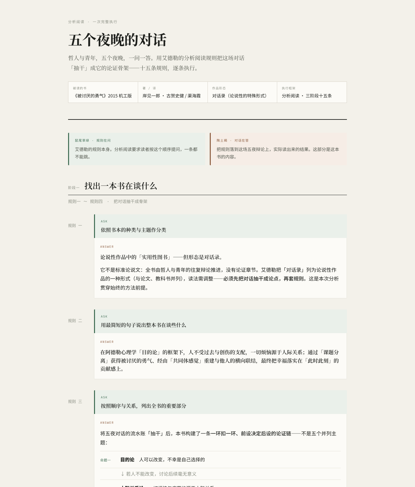
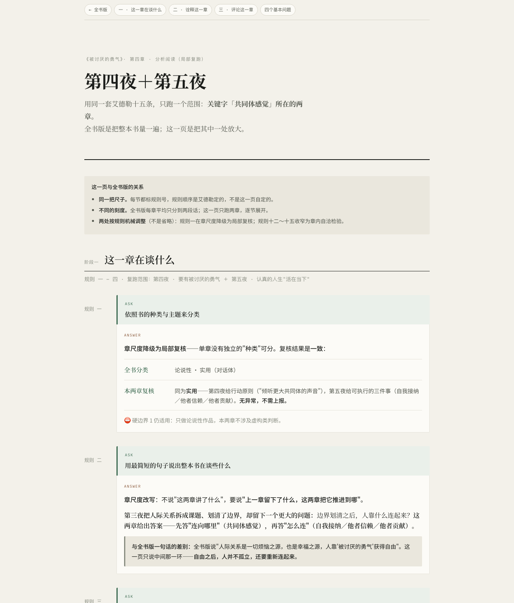

# Deep Read Skill · 深度阅读技能

[English](#english) · [中文](#中文)

---

## English

### Overview

Deep Read is a portable agent skill (Codex, ChatGPT, Claude Code) for analyzing expository nonfiction with Mortimer J. Adler and Charles Van Doren's fifteen rules of analytical reading.

It produces a traceable HTML reading guide that keeps all fifteen rules visible and ordered, verifies published quotations against the source text, and treats criticism as provisional rather than pretending one book can fact-check itself.

### Example output

Pages generated for *The Courage to Be Disliked* (Kishimi & Koga):

| Whole-book guide: rules 1→15 in order | Deep dive: the same fifteen rules rerun on two chapters |
|---|---|
|  |  |

### Design principles

| Principle | Meaning |
|---|---|
| Method before summary | Rules 1–15 form the reading path instead of becoming a hidden checklist. |
| Content before decoration | A book-specific visual metaphor may improve comprehension but cannot replace the analytical structure. |
| Exact quotations | Bundled verification rejects paraphrases presented as quotations. |
| Clear evidence boundaries | Textual interpretation and external fact-checking remain separate. |
| Continuous reading | A follow-up mode preserves the reader's exact question and examines the smallest useful source window. |
| Same ruler, finer scale | A deep-dive mode reruns rules 1–15 inside one chapter or concept range instead of inventing a new outline. |

### Workflow

1. Verify the edition and extract complete source text.
2. Classify the work as expository and theoretical or practical.
3. Run three analytical passes covering rules 1–4, 5–8, and 9–15.
4. Verify every quotation locally against the source.
5. Build an HTML guide whose fixed backbone is rules 1→15.
6. Render and inspect the result on desktop and mobile.

### Installation

Copy the `deep-read` directory into a skill location supported by your agent:

```bash
mkdir -p ~/.agents/skills
cp -R deep-read ~/.agents/skills/deep-read
```

For Claude Code, copy it to `~/.claude/skills/deep-read` instead; the same `SKILL.md` works there.

Then invoke it explicitly with `$deep-read`, or ask the agent to deeply analyze a specific nonfiction book.

### Requirements

- Python 3.10+ for the bundled standard-library EPUB and quotation utilities.
- A host agent capable of reading the source and creating HTML.
- Optional: any document-analysis or research backend available in the host environment.

No proprietary research service, browser profile, fixed local directory layout, or book-download service is required.

### Included utilities

```bash
# Inspect EPUB metadata and table of contents
python3 deep-read/scripts/inspect_epub.py BOOK.epub --toc

# Extract a chapter or section window
python3 deep-read/scripts/extract_epub_node.py BOOK.epub "CHAPTER TITLE" -o chapter.txt

# Verify one quotation per line against the source
python3 deep-read/scripts/verify_quotes.py --source fulltext.txt --quotes quotes.txt
```

The scripts use only the Python standard library.

### Repository structure

```text
deep-read/
├── deep-read/
│   ├── SKILL.md
│   ├── agents/openai.yaml
│   ├── references/
│   │   ├── adler-prompts.md
│   │   ├── follow-up.md
│   │   ├── html-contract.md
│   │   └── scope-rerun.md
│   └── scripts/
│       ├── extract_epub_node.py
│       ├── inspect_epub.py
│       └── verify_quotes.py
├── LICENSE
└── README.md
```

### License and attribution

Released under the [MIT License](LICENSE).

This independent project applies ideas from *How to Read a Book* by Mortimer J. Adler and Charles Van Doren. It is not affiliated with or endorsed by the authors, publishers, OpenAI, or any book-distribution service.

---

## 中文

### 项目简介

Deep Read 是一个可移植的 Agent Skill（Codex／ChatGPT／Claude Code 通用），使用莫提默·艾德勒与查尔斯·范多伦提出的分析阅读十五条规则，系统精读论说性非虚构作品。

它会生成一份可追溯的 HTML 阅读指南：十五条规则始终清晰可见并保持原有顺序；所有公开引文都必须回到原文逐字核验；对作者的批评只作为“待议候选”，不会假装一本书能够独立核验自身的历史与事实判断。

### 效果示例

以《被讨厌的勇气》（岸见一郎、古贺史健）为例生成的页面：

| 全书版：规则 1→15 逐条执行 | 深挖版：同一套十五条在两章内重跑 |
|---|---|
|  |  |

### 设计原则

| 原则 | 含义 |
|---|---|
| 方法先于摘要 | 规则 1—15 是实际阅读路径，而不是藏在后台的检查清单。 |
| 内容先于装饰 | 可以根据每本书设计专属视觉母题，但不得取代分析结构。 |
| 引文必须精确 | 内置校验脚本会拒绝被当作原文呈现的改写与拼接。 |
| 证据边界清楚 | 书内文本分析与外部事实核验严格分开。 |
| 阅读可以续接 | 追问模式保留读者问题原话，只分析能够回答问题的最小原文范围。 |
| 同一把尺子，换细刻度 | 深挖模式在某一章或某个概念范围内重跑规则 1—15，不另起一套大纲。 |

### 工作流程

1. 核验版本，并取得完整原文。
2. 判断作品是否属于论说性作品，以及偏理论还是偏实用。
3. 分三轮执行规则 1—4、5—8、9—15。
4. 将所有拟采用引文与本地原文逐字核验。
5. 生成以规则 1→15 为固定骨架的 HTML 阅读指南。
6. 在桌面端和手机端渲染检查。

### 安装方法

将 `deep-read` 目录复制到 Agent 支持的 Skill 目录，例如：

```bash
mkdir -p ~/.agents/skills
cp -R deep-read ~/.agents/skills/deep-read
```

Claude Code 用户复制到 `~/.claude/skills/deep-read` 即可，同一份 `SKILL.md` 通用。

然后显式调用 `$deep-read`，或者直接要求 Agent 系统精读某一本非虚构作品。

### 环境要求

- Python 3.10+，用于运行随附的 EPUB 与引文校验工具。
- 能够读取原始书稿并生成 HTML 的宿主 Agent。
- 可选：宿主环境提供的任意文档分析或研究后端。

本项目不强制依赖任何专有研究服务、浏览器 Profile、固定本机目录或图书下载服务。

### 随附工具

```bash
# 检查 EPUB 元数据与目录
python3 deep-read/scripts/inspect_epub.py BOOK.epub --toc

# 抽取某一章或某一节的原文窗口
python3 deep-read/scripts/extract_epub_node.py BOOK.epub "章节标题" -o chapter.txt

# 将每行一条的引文与原文逐字核验
python3 deep-read/scripts/verify_quotes.py --source fulltext.txt --quotes quotes.txt
```

所有脚本都只使用 Python 标准库。

### 仓库结构

```text
deep-read/
├── deep-read/
│   ├── SKILL.md
│   ├── agents/openai.yaml
│   ├── references/
│   │   ├── adler-prompts.md
│   │   ├── follow-up.md
│   │   ├── html-contract.md
│   │   └── scope-rerun.md
│   └── scripts/
│       ├── extract_epub_node.py
│       ├── inspect_epub.py
│       └── verify_quotes.py
├── LICENSE
└── README.md
```

### 许可证与致谢

本项目采用 [MIT License](LICENSE) 开源。

本项目独立运用《如何阅读一本书》中莫提默·艾德勒与查尔斯·范多伦提出的分析阅读思想，与原作者、出版机构、OpenAI 及任何图书分发服务均无隶属或背书关系。
